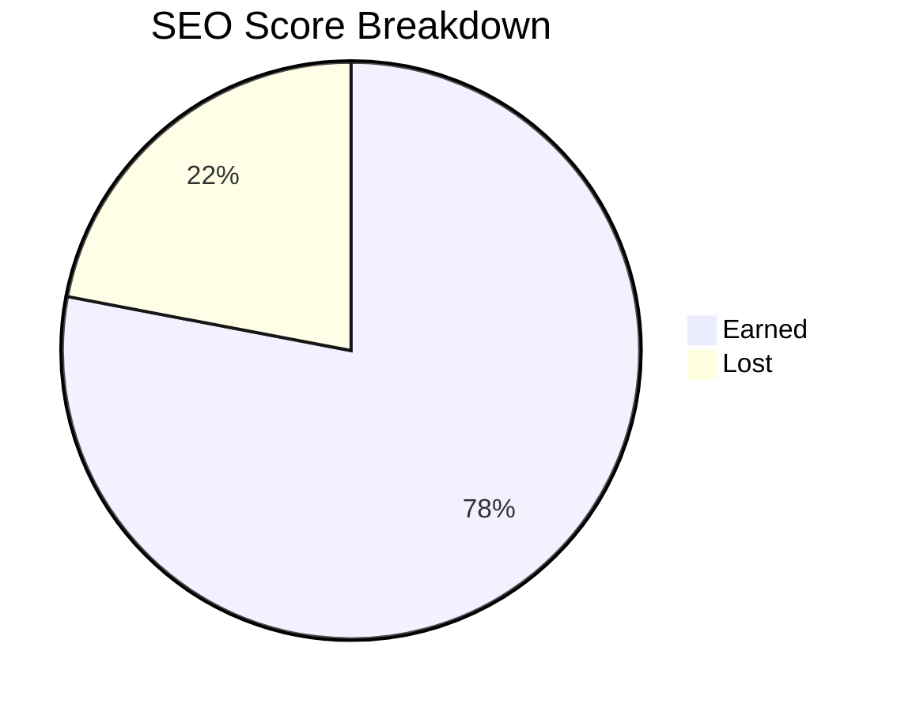

# Vanto Player — Full SEO Audit Report

> **Audit Date:** July 25, 2026  
> **Domain:** `vantoplayer.com`  
> **Framework:** Next.js 16.2.10 (App Router, SSG)

---

## Overall Score: 78 / 100

---

## 1. Technical SEO — Score: 88 / 100

| Factor | Score | Status | Details |
|---|---|---|---|
| **HTTPS / SSL** | 10/10 | ✅ | Site is served over HTTPS |
| **Sitemap** | 9/10 | ✅ | Dynamic [sitemap.ts](file:///home/lara/idea/vanto-player-website/app/sitemap.ts) generates all routes + 33 blog slugs. Missing: `/activation` is intentionally excluded |
| **Robots.txt** | 10/10 | ✅ | [robots.ts](file:///home/lara/idea/vanto-player-website/app/robots.ts) correctly generates valid output: `Allow: /`, `Disallow: /api/`, includes Sitemap URL |
| **Canonical Tags** | 9/10 | ✅ | Present on all pages using `buildMetadata()`. Blog posts use `generateMetadata()` with canonical. Minor: 5 legal pages (terms, privacy, refund, dmca, legal) use raw `Metadata` but still include `alternates.canonical` |
| **Server-Side Rendering** | 10/10 | ✅ | All routes are SSG (Static Site Generation). Build output confirms `○ (Static)` for every route. Google will have zero rendering issues |
| **Structured Data (JSON-LD)** | 8/10 | ✅ | [JsonLd.tsx](file:///home/lara/idea/vanto-player-website/components/seo/JsonLd.tsx) provides `Organization`, `SoftwareApplication`, `VideoObject`, `FAQPage` schemas. **Missing:** `BreadcrumbList` JSON-LD on blog post pages (breadcrumb nav exists in HTML but lacks schema markup) |
| **URL Structure** | 10/10 | ✅ | Clean, semantic slugs: `/blog/[slug]`, `/how-to/[topic]`, `/download`, `/activation` |
| **Crawl Efficiency** | 8/10 | ⚠️ | No `404.tsx` / `global-not-found.tsx` custom page detected. Next.js provides a default, but a custom one with internal links would reduce bounce and aid crawl recovery |
| **Page Speed Architecture** | 8/10 | ✅ | Lazy-load YouTube facade in [FeatureVideo.tsx](file:///home/lara/idea/vanto-player-website/components/sections/FeatureVideo.tsx). Priority images on logo and hero. `display: "swap"` on fonts. Build compiles in ~5s |
| **Mobile Responsiveness** | 6/10 | ⚠️ | Responsive classes present throughout. However, no `viewport` `themeColor` meta tag is set, and `next.config.ts` has no `viewport` export |

---

## 2. On-Page SEO — Score: 72 / 100

| Factor | Score | Status | Details |
|---|---|---|---|
| **Title Tags** | 9/10 | ✅ | Every page has a unique, keyword-rich title. Homepage: "Vanto Player: Premium IPTV & Media Player". Blog posts use dynamic `generateMetadata`. Template pattern: `%s \| Vanto Player` |
| **Meta Descriptions** | 8/10 | ✅ | All key pages have descriptions. Blog posts use `post.excerpt`. Minor: some excerpts may be too long (>160 chars) |
| **H1 Tags** | 10/10 | ✅ | Single `<h1>` on every page. Homepage, download, blog index, blog posts, contact — all have exactly one |
| **Heading Hierarchy** | 9/10 | ✅ | Proper `H1 → H2 → H3` throughout. Only minor issue: [CompatibleDevices.tsx](file:///home/lara/idea/vanto-player-website/components/sections/CompatibleDevices.tsx) uses `<h2>` with very small text styling (`text-sm`), which is semantically correct but visually misleading |
| **Image Alt Text** | 10/10 | ✅ | All images have descriptive, keyword-rich alt attributes (e.g., "Vanto Player Android Mobile Interface - Live TV Screen") |
| **OpenGraph / Twitter Cards** | 5/10 | ❌ | **Critical gap.** Only pages using `buildMetadata()` get OG/Twitter tags (homepage, download, how-to guides, activation, support). **Missing OG/Twitter on:** `/blog` listing, all `/blog/[slug]` posts, `/contact`, `/terms`, `/privacy`, `/refund`, `/dmca`, `/legal`. Blog posts are the highest-traffic content and are completely missing social sharing metadata |
| **Internal Links (Nav)** | 7/10 | ⚠️ | Header and Footer use **absolute URLs** (`https://vantoplayer.com/...`) instead of relative paths. While functional, this bypasses Next.js client-side navigation and forces full page reloads, hurting UX and Core Web Vitals |
| **Internal Links (Content)** | 8/10 | ✅ | Just improved — 142 contextual links injected across 33 blog posts. Blog post pages also show 3 related articles |

---

## 3. Content SEO — Score: 65 / 100

| Factor | Score | Status | Details |
|---|---|---|---|
| **Content Volume** | 9/10 | ✅ | 33 blog posts, 6 how-to guides, multiple landing pages. Strong topical coverage |
| **Keyword Cannibalization** | 3/10 | ❌ | **Serious issue.** Multiple posts target nearly identical keywords. Examples of competing pages: |
| | | | • `best-iptv-players-smart-tv-android-firestick` vs `top-10-iptv-players-usa-2026` vs `top-rated-m3u-players-usa-app-store` |
| | | | • `install-vanto-player-firestick` vs `/how-to/install-on-firestick-android-tv` |
| | | | • `install-vanto-player-smart-tv` vs `/how-to/install-on-samsung-smart-tv` vs `/how-to/install-on-lg-webos` |
| **Blog Post Categories** | 4/10 | ❌ | All posts are labeled "GUIDE" with a hardcoded tag. No real categorization or tagging system. This makes it hard for Google to understand topic clusters |
| **Content Freshness** | 7/10 | ⚠️ | Blog post dates are set via frontmatter. Sitemap `lastModified` for static pages uses `new Date()` (current date on each build), which is good. But blog `lastModified` uses the post's `date` field, so older posts appear stale |
| **Related Posts Logic** | 4/10 | ❌ | [Blog slug page](file:///home/lara/idea/vanto-player-website/app/blog/%5Bslug%5D/page.tsx#L52) shows "Related Articles" but the logic is just `allPosts.filter(p => p.slug !== slug).slice(0, 3)` — it picks the **first 3 posts by date**, not actually related content. This is a missed SEO opportunity |
| **Reading Time** | 5/10 | ⚠️ | Blog listing hardcodes "5 MIN READ" for every post. Not calculated from actual content length |

---

## 4. Performance & Core Web Vitals — Score: 82 / 100

| Factor | Score | Status | Details |
|---|---|---|---|
| **LCP Optimization** | 9/10 | ✅ | Logo and hero images use `priority` attribute. Font `display: "swap"` prevents FOIT |
| **YouTube Lazy Loading** | 9/10 | ✅ | [FeatureVideo.tsx](file:///home/lara/idea/vanto-player-website/components/sections/FeatureVideo.tsx) uses a click-to-play facade. iframe only loads on interaction |
| **Font Loading** | 8/10 | ✅ | Geist fonts via `next/font/google` with `display: "swap"`. Good. Minor: `globals.css` body also sets `font-family: Arial, Helvetica, sans-serif` which conflicts with the Geist font variable |
| **Image Optimization** | 8/10 | ✅ | Using `next/image` throughout with `fill` and responsive `sizes`. Background images in CSS (`bg-[url('/image.jpg')]`) bypass optimization |
| **Client Components** | 7/10 | ⚠️ | `Header.tsx`, `FAQ.tsx`, `FeatureVideo.tsx`, and `contact/page.tsx` are `'use client'`. The **Header is on every page** and includes state management. The Contact page is entirely client-side, meaning its metadata `export` won't work — **the `/contact` page has NO metadata at all** |
| **Bundle Size** | 8/10 | ✅ | Minimal dependencies. `lucide-react` supports tree-shaking. No heavy UI library |

---

## 5. Accessibility & UX — Score: 80 / 100

| Factor | Score | Status | Details |
|---|---|---|---|
| **Form Labels** | 9/10 | ✅ | Contact form has proper `<label htmlFor>` on all fields |
| **ARIA Attributes** | 7/10 | ⚠️ | Header hamburger button has `aria-label` and `aria-expanded`. But decorative icons from `lucide-react` do NOT have `aria-hidden="true"` in the component source — they rely on the library's defaults |
| **Skip Navigation** | 2/10 | ❌ | No "Skip to main content" link for keyboard/screen-reader users |
| **Focus Management** | 6/10 | ⚠️ | Mobile menu uses `focus:outline-none` on the hamburger button, removing focus visibility for keyboard users |
| **Semantic HTML** | 9/10 | ✅ | Uses `<header>`, `<main>`, `<footer>`, `<nav>`, `<article>`, `<section>` appropriately |
| **Color Contrast** | 7/10 | ⚠️ | Body text on dark sections uses `text-white/70` (70% opacity white on `#0a0a0a`). This yields a contrast ratio of ~8.5:1 (passes WCAG AA). But `text-gray-400` on `#111111` backgrounds (~4.1:1) barely passes |

---

## Priority Fix List

### 🔴 Critical (High Impact)

| # | Issue | File(s) | Impact |
|---|---|---|---|
| 1 | **`/contact` page has NO metadata** — it's a `'use client'` component, so `export const metadata` won't work | [contact/page.tsx](file:///home/lara/idea/vanto-player-website/app/contact/page.tsx) | Google indexes it with the default title template only. No description, no OG tags |
| 2 | **Blog posts missing OG/Twitter tags** — `generateMetadata` in [blog/[slug]/page.tsx](file:///home/lara/idea/vanto-player-website/app/blog/%5Bslug%5D/page.tsx#L13-L31) only sets `title`, `description`, and `canonical`. No `openGraph` or `twitter` | [blog/[slug]/page.tsx](file:///home/lara/idea/vanto-player-website/app/blog/%5Bslug%5D/page.tsx) | Blog articles shared on social media will show generic previews instead of rich cards |
| 3 | **Keyword cannibalization** between blog posts and `/how-to/` pages | `posts/*.md` vs `app/how-to/*` | Google can't determine which page to rank, diluting authority across competing pages |
| 4 | **Header/Footer use absolute URLs** instead of relative paths | [Header.tsx](file:///home/lara/idea/vanto-player-website/components/layout/Header.tsx#L19-L27), [Footer.tsx](file:///home/lara/idea/vanto-player-website/components/layout/Footer.tsx#L14-L51) | Causes full page reloads instead of SPA navigation, hurting INP/CLS metrics |

### 🟡 Important (Medium Impact)

| # | Issue | File(s) | Impact |
|---|---|---|---|
| 5 | **Legal pages** (`/terms`, `/privacy`, `/refund`, `/dmca`, `/blog`) use raw `Metadata` — missing OG/Twitter/robots fields | Various `page.tsx` files | Incomplete social previews on these pages |
| 6 | **Related posts are not actually related** — just the first 3 by date | [blog/[slug]/page.tsx](file:///home/lara/idea/vanto-player-website/app/blog/%5Bslug%5D/page.tsx#L52) | Missed opportunity for engagement and internal link equity |
| 7 | **No BreadcrumbList JSON-LD on blog posts** — HTML breadcrumb exists but no schema | [blog/[slug]/page.tsx](file:///home/lara/idea/vanto-player-website/app/blog/%5Bslug%5D/page.tsx#L61-L67) | Google won't show breadcrumb-rich snippets for blog articles in search results |
| 8 | **Font conflict** — `globals.css` sets `font-family: Arial` which conflicts with Geist font variables | [globals.css](file:///home/lara/idea/vanto-player-website/app/globals.css#L27) | Browser may flash Arial before Geist loads, or override Geist entirely |
| 9 | **Hardcoded "5 MIN READ"** on all blog cards | [blog/page.tsx](file:///home/lara/idea/vanto-player-website/app/blog/page.tsx#L99) | Inaccurate reading times reduce user trust |

### 🟢 Nice to Have (Low Impact)

| # | Issue | File(s) | Impact |
|---|---|---|---|
| 10 | Add `"Skip to main content"` link | [layout.tsx](file:///home/lara/idea/vanto-player-website/app/layout.tsx) | Accessibility best practice for keyboard users |
| 11 | Add `themeColor` to metadata | [layout.tsx](file:///home/lara/idea/vanto-player-website/app/layout.tsx) | Controls browser chrome color on mobile |
| 12 | Implement blog post categories/tags in frontmatter | `posts/*.md`, `lib/blog.ts` | Enables topic clustering and filtered views |
| 13 | Calculate actual reading time from content length | `lib/blog.ts`, `blog/page.tsx` | More accurate UX signal |
| 14 | Custom 404 page with helpful internal links | `app/global-not-found.tsx` | Reduces bounce rate on dead links |

---

## Score Summary by Category

| Category | Score | Weight | Weighted |
|---|---|---|---|
| Technical SEO | 88/100 | 25% | 22.0 |
| On-Page SEO | 72/100 | 25% | 18.0 |
| Content SEO | 65/100 | 20% | 13.0 |
| Performance | 82/100 | 15% | 12.3 |
| Accessibility | 80/100 | 15% | 12.0 |
| **Total** | | **100%** | **77.3 ≈ 78** |

> [!TIP]
> Fixing items **#1–#4** alone (contact metadata, blog OG tags, keyword cannibalization, and relative URLs in nav) would likely push the score to **~88/100**.
